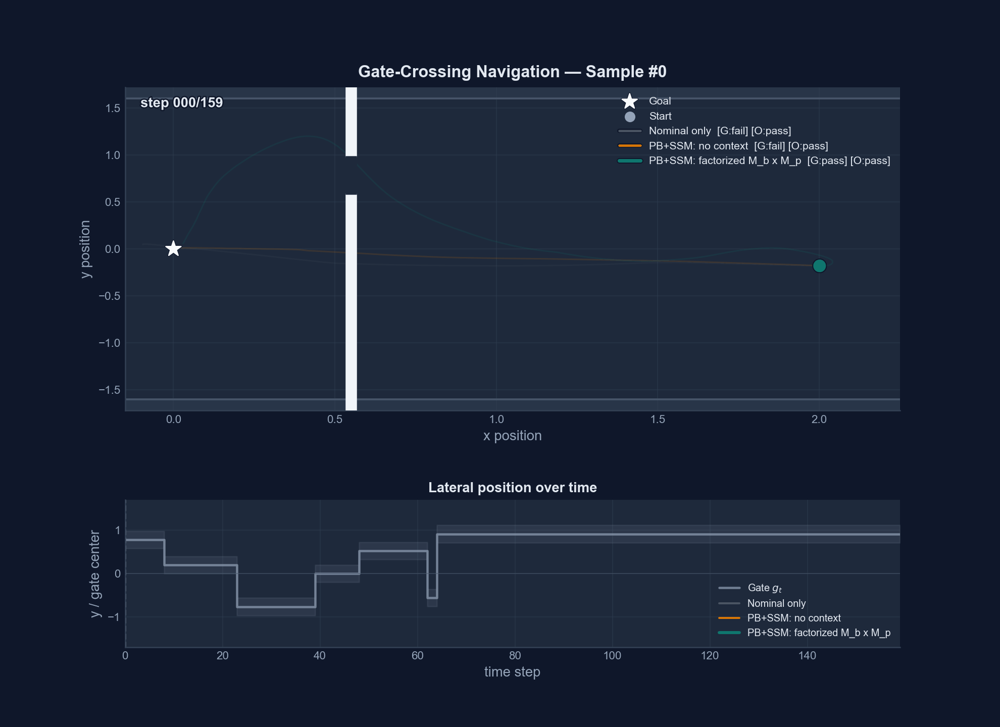

# Moving Gate Experiment

A planar navigation task that demonstrates the advantage of **contextual
Performance Boosting** over a disturbance-only baseline.



---

## Task description

A pre-stabilised double integrator must reach the origin `(0, 0)` while
passing through a **moving gate** embedded in a wall at `x = x_w`.
The gate opening has half-width `h` and its centre `g_t` switches
randomly between two positions at discrete times, then freezes before
the crossing window.

The robot must decide **in real time** when to commit to a crossing
direction — too early and it may be caught by a late switch; too late
and it overshoots the goal.  Neither the nominal pre-stabiliser nor a
disturbance-only PB operator has access to `g_t`, so they cannot adapt.
The context-enriched PB operator receives a compact, causal summary of
the gate and learns to time its corrective action accordingly.

---

## Setup

| Quantity | Description |
|---|---|
| State | 2D position + velocity `(x, y, vx, vy)` |
| Control | 2D force input `(ux, uy)` |
| Gate | Centre `g_t` switches stochastically, freezes `gate_settle_steps` before the wall |
| Context `z_t` | Gate error `(y_t − g_t)`, proximity to wall `α_t`, gate switch age `σ_t` |
| Horizon | 160 steps, `dt = 0.05 s` |

The three context features are **directly observable** without knowledge
of the freeze schedule: a rising switch age `σ_t` near the wall
(`α_t ≈ 1`) indicates that the gate has been stable long enough to
commit.

---

## Variants compared

| Variant | Description |
|---|---|
| **Nominal** | Pre-stabiliser only, no PB correction |
| **PB: no context** | PB+SSM operator seeing only disturbance `w_t` |
| **PB: factorized M_b × M_p** | PB+SSM with context-aware factorized operator |
| **PB: MAD (s=1)** | Special case with scalar `M_p` magnitude and bounded `M_b(w,z)` direction mixer |

---

## Running the experiment

From the repository root:

```bash
cd experiments/contextual_pb_gate_ssm
python Moving_gate_exp.py --no_show_plots
```

To reproduce plots from a completed run without retraining:

```bash
cd experiments/contextual_pb_gate_ssm
python Moving_gate_exp.py --plot_only controlled_xy_<timestamp>
```

Results are written to:

```
experiments/contextual_pb_gate_ssm/runs/<run_id>/
```

Key outputs per run:

| File | Description |
|---|---|
| `wall_style_summary.png` | Trajectory overview + success rates |
| `trajectory_samples.png` | Per-sample top-down trajectories |
| `adversarial_switching.png` | Performance under late adversarial gate switch |
| `rollout_animation_*.gif` | Animated rollouts |
| `*_controller.pt` | Saved controller weights |
| `metrics.json` | Numerical evaluation metrics |

## Running on EPFL RCP / Run:AI

For a beginner-friendly explanation of every component and the complete workflow,
see [EPFL RCP From Zero](docs/EPFL_RCP_FROM_ZERO.md).

The RCP tutorial uses Docker plus Run:AI, not `sbatch`. The one-time setup is:
install `docker`, `kubectl`, and `runai`; create a public Harbor project; then
configure RCP access:

```bash
mkdir -p ~/.kube
curl https://wiki.rcp.epfl.ch/public/files/kube-config.yaml -o ~/.kube/config
chmod 600 ~/.kube/config
runai login
runai cluster list
runai cluster set <cluster-name>
runai project list
runai project set <runai-project-name>
```

Build and push the Docker image from your laptop. Use the UID/GID values from
EPFL, and the Harbor project name you created:

```bash
GASPAR=<gaspar> LDAP_UID=<uid> LDAP_GID=<gid> PROJECT=<harbor-project> \
  IMAGE=performance-boosting TAG=v1.1 \
  scripts/rcp_build_push_image.sh
```

The image uses `DockerfileRCP` and `requirements-rcp.txt`. PyTorch is not in the
RCP requirements file because the NVIDIA PyTorch base image provides the CUDA
matched torch build.

On the RCP jumphost, clone or update this repository, then return to the Mac:

```bash
ssh <gaspar>@jumphost.rcp.epfl.ch
git clone <repo-url> ~/Performance_Boosting
cd ~/Performance_Boosting
git pull --ff-only
exit
```

Submit a short moving-gate smoke test from the Mac where Run:AI is configured:

```bash
GASPAR=<gaspar> PROJECT=<harbor-project> IMAGE=performance-boosting TAG=v1.1 \
  RUNAI_PROJECT=<runai-project-name> \
  GPU=0.1 scripts/rcp_runai_submit.sh \
  --epochs 2 --disturbance_only_epochs 1 \
  --train_batch 16 --val_batch 16 --test_batch 16 \
  --variants disturbance_only,context \
  --no_storyboard --no_storyboard_compact
```

Submit a full moving-gate run:

```bash
GASPAR=<gaspar> PROJECT=<harbor-project> IMAGE=performance-boosting TAG=v1.1 \
  RUNAI_PROJECT=<runai-project-name> \
  JOB_NAME=pb-gate-full RUN_ID=rcp_gate_full GPU=1 \
  scripts/rcp_runai_submit.sh --epochs 250
```

Submit the moving-obstacles variant. Set `--epochs` explicitly because its
default is intentionally large:

```bash
GASPAR=<gaspar> PROJECT=<harbor-project> IMAGE=performance-boosting TAG=v1.1 \
  RUNAI_PROJECT=<runai-project-name> \
  EXPERIMENT=obstacles JOB_NAME=pb-obstacles-full RUN_ID=rcp_obstacles_full GPU=1 \
  scripts/rcp_runai_submit.sh --epochs 250
```

Useful current Run:AI commands from the Mac:

```bash
runai training list -p <runai-project-name>
runai training standard describe <job-name> -p <runai-project-name>
runai training standard logs <job-name> -p <runai-project-name> --follow
runai training standard delete <job-name> -p <runai-project-name>
```

Copy results back from a local terminal:

```bash
scp -r <gaspar>@jumphost.rcp.epfl.ch:~/Performance_Boosting/experiments/contextual_pb_gate_ssm/runs/<run_id> ~/Desktop/
```

Results are written under the matching experiment directory:

```text
experiments/contextual_pb_gate_ssm/runs/<run_id>/
experiments/contextual_pb_obstacles_ssm/runs/<run_id>/
```

The repository also includes `scripts/rcp_experiment.sbatch` as a generic Slurm
fallback for clusters that actually expose `sbatch`; it is not the primary RCP
path from the tutorial.

---

## Moving Obstacles Variant

There is now a sibling experiment where the robot starts from a chosen
initial position and must still reach the origin, but instead of
crossing a moving gate it must avoid **moving circular obstacles**
that can travel in arbitrary 2D directions along the route. The
contextual variant receives each obstacle's relative position together
with its velocity vector, so it can anticipate where the obstacle is
going rather than only reacting to its current location.
Both contextual experiments also include a MAD-style special case
(`s=1`) that compares the full context-aware factorized operator against
a scalar-magnitude, bounded-direction policy.

Run it from the repository root with:

```bash
cd experiments/contextual_pb_obstacles_ssm
python Moving_obstacles_exp.py --no_show_plots
```

Its outputs are written to:

```
experiments/contextual_pb_obstacles_ssm/runs/<run_id>/
```

Key obstacle outputs include static summaries plus `rollout_animation_*.gif`
files showing the moving obstacles and the robot trajectories over time.

---

## Tethered Cargo Slalom

This experiment makes payload context structurally necessary. A four-state
carrier must tow a private, dynamically swinging cargo body through three
alternating precision gates. Alias-paired trials have the same observed carrier
state, route, mass, and process noise, but opposite hidden cargo velocity. A
route-only controller therefore sees identical inputs for two situations that
require different first moves; the full-context controller additionally gets
causal payload position, velocity, extension, tension, and mass telemetry.

Success is deliberately strict: the carrier, cargo, and sampled points along
the tether must all clear every gate, then the carrier must dock while the
cargo settles into the trailing formation.
The legacy pickup/drop docking task remains available with `--task docking`.

The nominal model and the observed carrier subsystem of the true plant now use
the same strongly nonlinear, pre-stabilised dynamics. With carrier position
\(q\in\mathbb R^2\), velocity \(v\), command \(u\), and
\(J[v_x,v_y]^\top=[-v_y,v_x]^\top\), the continuous-time model is

\[
\dot q=v,\qquad
\dot v=-k_pq-k_3\lVert q\rVert^2q-k_dv-c_2\lVert v\rVert v
+\omega\tanh(sq_xq_y)Jv
+\frac{a\tanh(u/a)}{1+\alpha\lVert v\rVert^2}.
\]

The saturation is elementwise. The gyroscopic term is nonlinear but
energy-neutral. For zero input,

\[
V(q,v)=\tfrac12\lVert v\rVert^2+\tfrac{k_p}{2}\lVert q\rVert^2
+\tfrac{k_3}{4}\lVert q\rVert^4,\qquad
\dot V=-k_d\lVert v\rVert^2-c_2\lVert v\rVert^3\le0,
\]

so the carrier is pre-stabilised at the origin. The true plant additionally
integrates a private cargo position and velocity with nonlinear tether geometry,
unilateral spring-damper tension, and quadratic drag. Under the default
heavy-carrier assumption (`--slalom_tether_reaction 0`), this private state does
not perturb the carrier transition. After the shared semi-implicit discretisation,

\[
x_{k+1}=f_{\mathrm{nl}}(x_k,u_k)+\eta_k,\qquad
w_0=0,\quad w_k=\eta_{k-1}\ (k\ge1).
\]

Thus \(w\) is exactly the configured tapered process noise and decays to zero;
it contains no hidden-payload shortcut. Context shines because safe gate
crossing and final settling depend on the unobserved nonlinear cargo state even
when the carrier state, route, and reconstructed disturbance are aliased.

Run it from the repository root:

```bash
python experiments/contextual_pb_payload_ssm/Moving_payload_exp.py --no_show_plots
```

The dedicated launcher exposes every experiment parameter, controller variant,
and causal context feature, and browses the saved figures, GIFs, PDF storyboard,
and telemetry-intervention results:

```bash
.venv/bin/streamlit run experiments/contextual_pb_payload_ssm/launcher_app.py
```

Each held-out run saves its exact test batch and includes route-only versus full
context, an OOD mass-and-tether stress case, delayed/wrong/missing-telemetry
interventions, a split-screen GIF, gate-clearance plots, an alias-pair figure,
a reconstructed-noise identity plot, and an event storyboard. Results are under:

```text
experiments/contextual_pb_payload_ssm/runs/<run_id>/
```

Submit it through Run:AI with the existing helper by selecting the payload
script:

```bash
GASPAR=<gaspar> PROJECT=<harbor-project> IMAGE=performance-boosting TAG=v1.1 \
  EXPERIMENT=payload JOB_NAME=pb-payload-full RUN_ID=rcp_payload_full GPU=1 \
  scripts/rcp_runai_submit.sh --epochs 300
```
